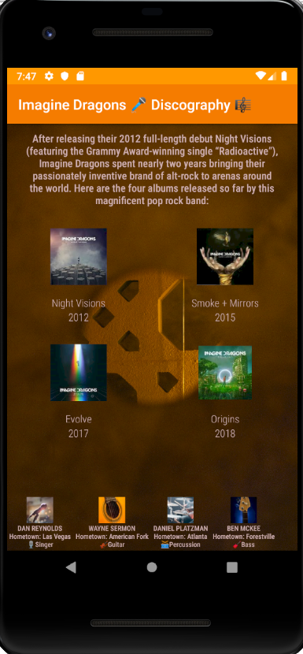
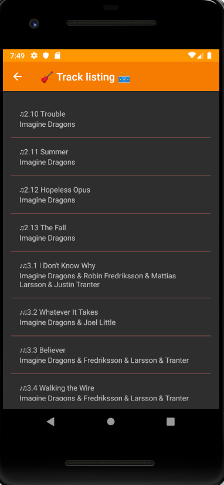
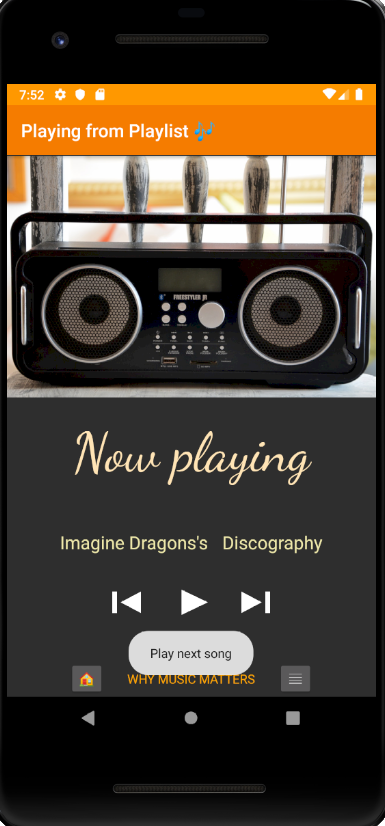
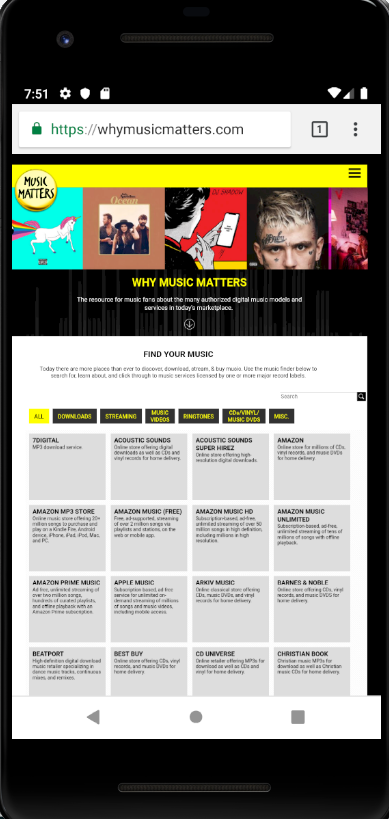

# Discography

This project is designed to layout the flow for the structure of a Music Player App. Note that this app actually doesn't play music and it's made just for educational purposes as it contains the code of my sixth project for Android Basics NanoDegree at Udacity.

  

The application's complete functionality requires interenet connection as it sends the user to a website by clicking on the "WHY MUSIC MATTERS" text.

  
